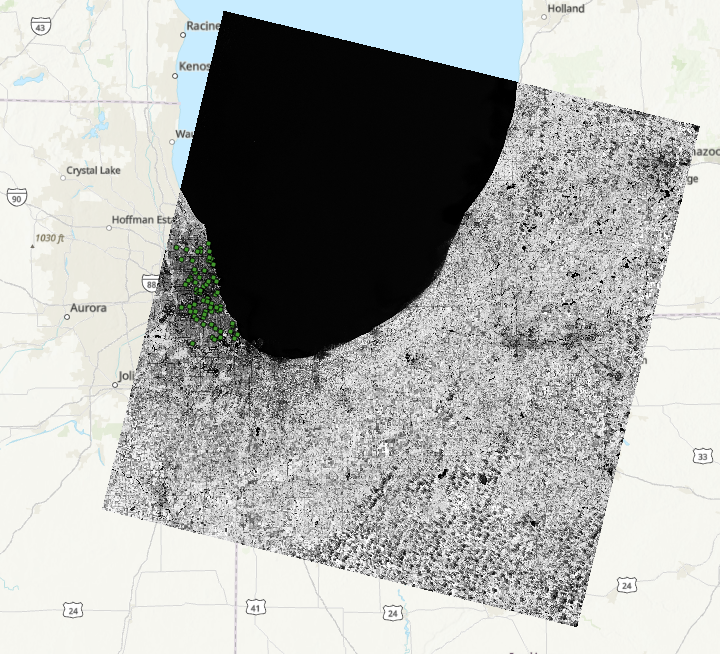
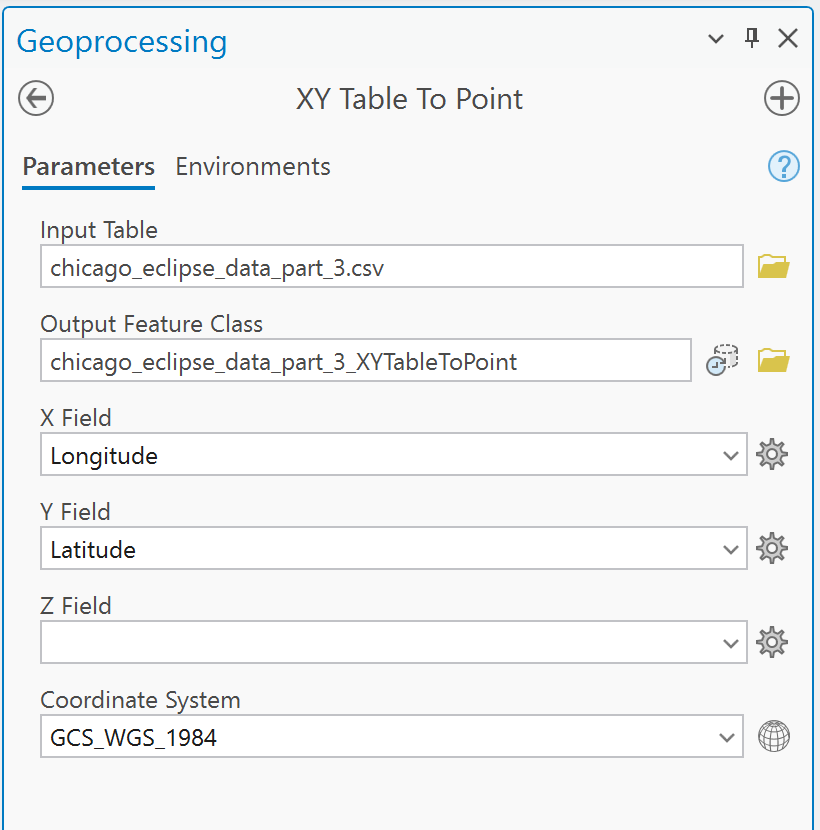
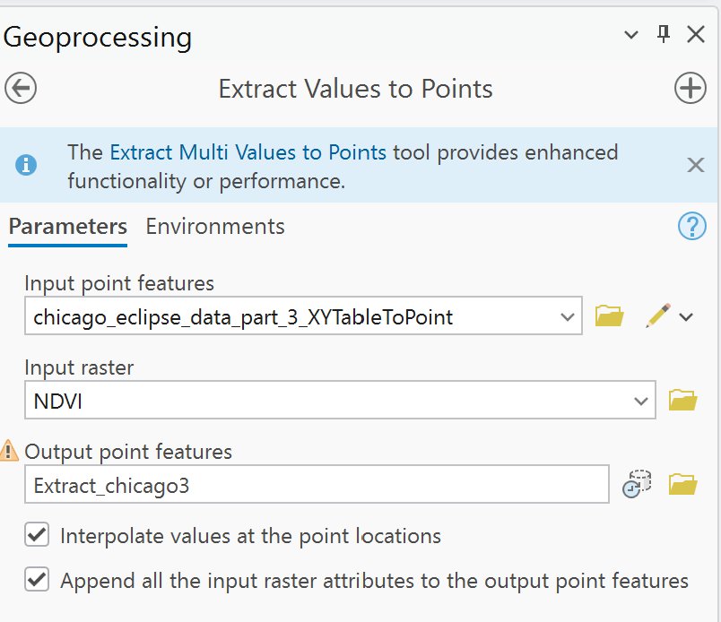
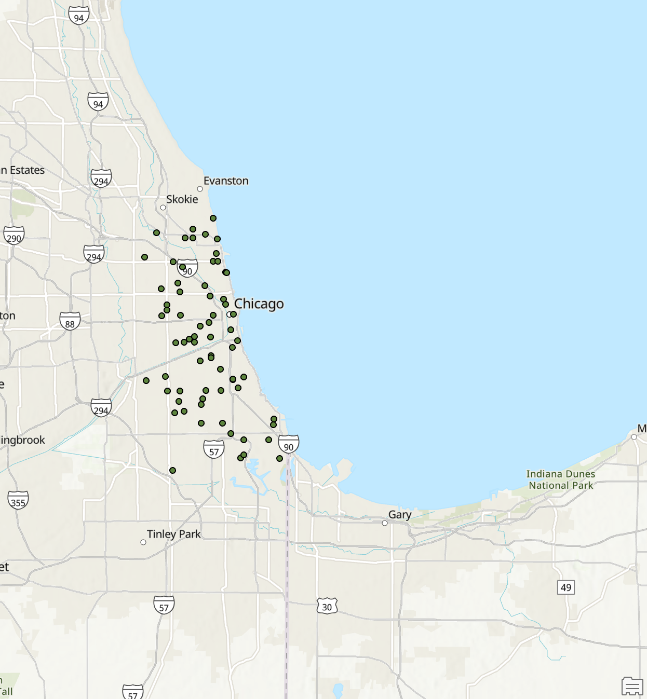

### ✅ Working Steps for Raster–Vector Overlay

#### **1. Prepare Inputs**
- **Raster**: Sentinel-2 GeoTIFF with Red (Band 4) and NIR (Band 5).
- **Vector**: CSV file with columns: `latitude`, `longitude`, and sensor value (e.g., `PM25`).
- **Verify**: Coordinates are in **decimal degrees** (e.g., `41.794921, -87.625857`), and the CSV has **no extra headers or formatting issues**.

#### **2. Steps to Add Raster Bands**
1. Open ArcGIS Pro.
2. Go to the **View** tab in the ribbon.
3. Click on the **Catalog Pane** to open it (if not already visible).
4. In the **Catalog Pane**, navigate to the **Folders** section.
5. Right-click on **Folders** and select **Add Folder Connection**.
6. Browse to the folder that contains the Landsat raster file.
7. Select the folder and click **OK** to establish the connection.
8. Locate the raster bands in the folder (e.g., `LC08_L2SP_022031_20210701_20210708_02_T1_SR_B4.TIF` and `LC08_L2SP_022031_20210701_20210708_02_T1_SR_B5.TIF`).
9. Drag and drop **Band 4** and **Band 5** onto the map to add them.


#### **3. Compute NDVI (If Not Precomputed)**
- Use **Raster Calculator** in ArcGIS Pro:
  ```python
  Float("B05_10m" - "B04_10m") / ("B05_10m" + "B04_10m")
  
  Float("LC08_L2SP_022031_20210701_20210708_02_T1_SR_B5.TIF" - "LC08_L2SP_022031_20210701_20210708_02_T1_SR_B4.TIF") / 
("LC08_L2SP_022031_20210701_20210708_02_T1_SR_B5.TIF" + "LC08_L2SP_022031_20210701_20210708_02_T1_SR_B4.TIF")`

Save the output as NDVI.tif.
it will apear as follows 



#### **4. Create Point Layer from CSV**
- Use **“XY Table to Point”** tool (not right-click “Add to Map”):
  - **Input Table**: Your CSV.
  - **X Field**: `longitude`
  - **Y Field**: `latitude`
  - **Coordinate System**: `GCS_WGS_1984` (EPSG:4326).
- This creates a **spatial point layer** visible on the map.




#### **5. Extract NDVI at Sensor Points**
- Use **“Extract Values to Points”** tool:
  - **Input point features**: The XY point layer from Step 4.
  - **Input raster**: `NDVI.tif`.
  - **Interpolation**: **Bilinear** (for continuous data like NDVI).
  - **Output**: `GroundTruth_NDVI.shp`.

  
  and


  

  
  - right-click on the output shapefile and open the attribute table to see extracted NDVI values.
  - The attribute table will include a new field (e.g., `RASTERVALU`) with NDVI values at each sensor location.
  - Export the attribute table to CSV for further analysis.
  - Right-click on the shapefile in the Table of Contents.
  - Select **Data** > **Export Table**.
  - Choose the output location and format (CSV).
  - Click **OK** to export.
  if this does not work use the following method:
  - #### **use `table to Excel` tool to convert the raster file to excel and then save it as xlsx**
  - Use **“Table to Excel”** tool:
    - **Input Table**: The attribute table of `GroundTruth_NDVI.shp`.
    - **Output Excel File**: `GroundTruth_NDVI.xlsx`.
    - Click **OK** to run the tool.
    - Open the resulting Excel file to view the extracted NDVI values alongside the sensor data.
    - Save the Excel file as CSV if needed for further analysis.
    - Now you have a CSV file with sensor values and corresponding NDVI values for analysis.
  - 
  - You can now use this CSV for correlation analysis between sensor values and NDVI.

  - Now you can proceed with correlation analysis between sensor values and NDVI.
  
  #### **Alternative 4. Extract NDVI at Sensor Points Using Zonal Statistics as Table**
- Use **“Zonal Statistics as Table”** tool:
- **Input raster or feature zone data**: The XY point layer from Step 3.
  - **Zone field**: Unique identifier for each point (e.g., `OBJECTID`).
  - **Input value raster**: `NDVI.tif`.
  - **Statistics type**: **MEAN** (to get average NDVI at each point).
  - **Output table**: `ZonalStats_NDVI.dbf`.
  - right-click on the output table and open it to see extracted NDVI values.
  - Export the table to CSV for further analysis.
  - Right-click on the table in the Table of Contents.
  - Select **Export** > **Table to CSV**.
  - Choose the output location and format (CSV).
  - Click **OK** to export.
  - The exported CSV will contain NDVI values corresponding to each sensor location.

